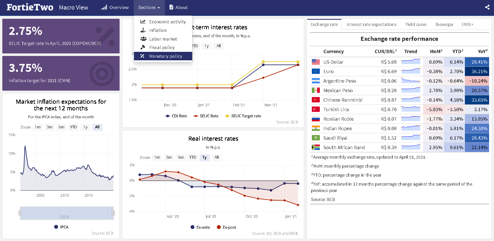

# macroview 

A dashboard of **Brazilian macroeconomic data**, using interactive charts and updated daily. The data comes from several public data sources, and covers the following topics:

- Economic activity
- Inflation
- Job market
- Fiscal policy
- Monetary policy

I hope this can be useful for you! Take a look:

## Report bugs

If you find any errors or have suggestions, feel free to create a [new issue](https://github.com/schoulten/macroview/issues) or contact me: <fernando@fortietwo.com>

## Next steps

These are some of the future steps to improve this dashboard:

- Reduce dependencies
- Improve function of deflating series
- Place messages at each stage of the ETL functions
- Improve framework using Shinyapps
